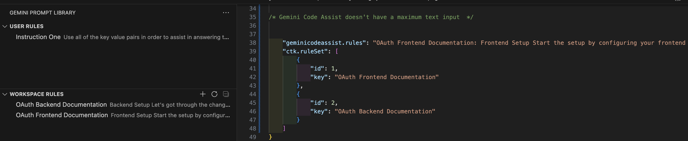

# Gemini Prompt Library

 ## Features

## Commands

*   `CTK GEE: Add Global/Workspace Rule`: Prompts for a new rule key and value and adds it.
*   `CTK GEE: Edit Global/Workspace Rule`: Allows selecting and editing an existing rule's key and value.
*   `CTK GEE: Delete Global/Workspace Rule`: Allows selecting and deleting a rule.
*   `CTK GEE: View Global/Workspace Rules`: Displays the current rules.
*   `CTK GEE: Force Sync Global/Workspace Rules`: Manually re-synchronizes `ctk.ruleSet` with `geminicodeassist.rules`.

 
 ---

