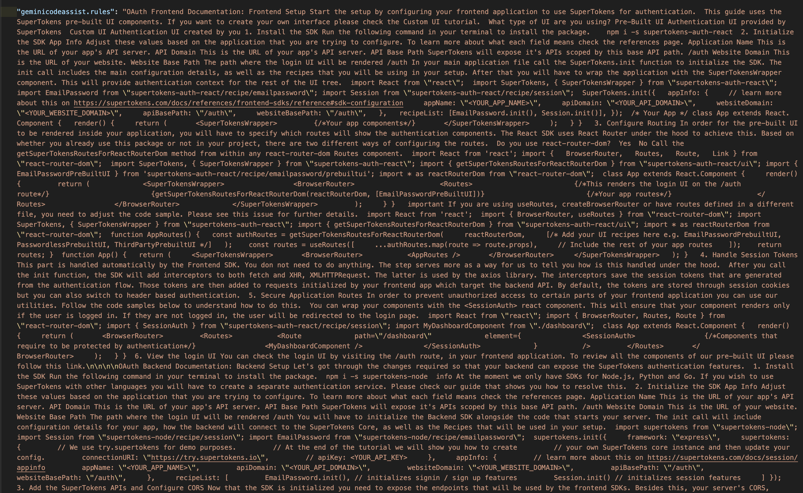
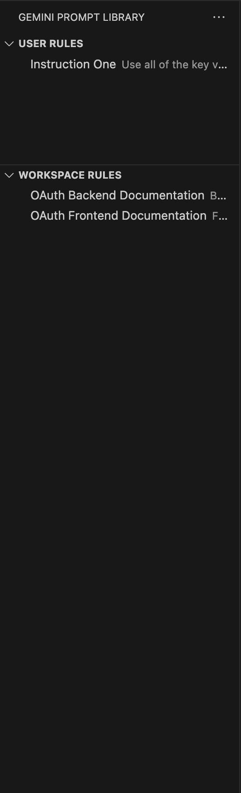
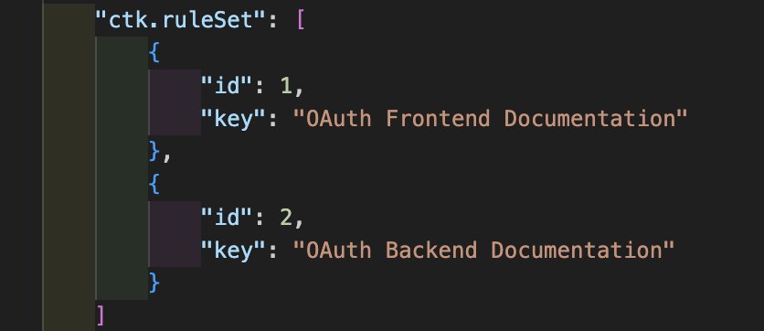

# Gemini Prompt Library

### [My Website](https://carsontkempf.github.io/)

---

## 1

### I was tired of my resources for Gemini looking like this:

## 2

### So I made an extension that allows key-value pairs to be used for Gemini's resources.

## 3

### It does this by mapping keys to id's

## 4

### So that our resources section can still look like this:

## 5

### But we only have to look at this:

---

# Commands

> `CTK GEE: Add Global/Workspace Rule`: Prompts for a new rule key and value and adds it.
>
> `CTK GEE: Edit Global/Workspace Rule`: Allows selecting and editing an existing rule's key and value.
> `CTK GEE: Delete Global/Workspace Rule`: Allows selecting and deleting a rule.
> 
> `CTK GEE: View Global/Workspace Rules`: Displays the current rules.
> 
> `CTK GEE: Force Sync Global/Workspace Rules`: Manually re-synchronizes `ctk.ruleSet` with `geminicodeassist.rules`.

